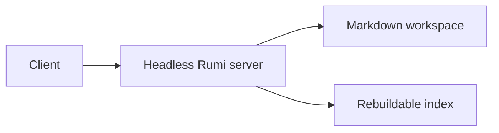

# **Complete content fixture**

This page exercises every property shape and content-block syntax currently exposed by the Rumi editor.

## **Inline content**

An internal document link points to the inner folder

This line ends with a hard break.  
This text remains in the same paragraph after the break.

Plain text, **bold**, *italic*, __underlined__, ~~struck through~~, inline code, default highlight, and[ an external link](https://example.com).

### **Heading level three**

The heading above verifies the smallest supported heading level.

## **Bullet list**

- Memory
- Mini PC chassis
- Storage

## **Numbered list**

1. Install memory
2. Install storage
3. Create the boot volume
4. Create the data volume
5. Boot the server

## **Task list**

- Choose a CPU
- Install the operating system
- Run a thermal test

## **Quote**


A useful home server should be quiet, efficient, repairable, and understandable.


The fixture uses realistic content without attempting to be a complete hardware specification.


## **Table**


| **Model**            | **CPU**        | **RAM** | **Storage** | **Wi-Fi** |
| --- | --- | --- | --- | --- |
| Beelink EQ12         | Intel N100     | 16 GB   | 500 GB      | Wi-Fi 6   |
| Minisforum UM790 Pro | Ryzen 9 7940HS | 32 GB   | 1 TB        | Wi-Fi 6E  |


## **Code block**


```
interface HomeServer {
  model: string
  memoryGb: number
  storageGb: number
  wifi: boolean
}
const candidate: HomeServer = {
  model: "Beelink EQ12",
  memoryGb: 16,
  storageGb: 500,
  wifi: true
}
```


## **Mermaid block**





## **Database view**


```db
source: Tasks
filter: status = doing
sort: updated desc
```


## **Image block**


## **File block**


## **Link paragraph**


[Example domain](https://example.com)


## **Divider**


---


Content after the divider verifies that normal editing continues after an atomic block.


```db
source: Tasks
```


This page exercises every property shape and content-block syntax currently exposed by the Rumi editor.


## **Inline content**


An internal document link points to the inner folder


This line ends with a hard break.  
This text remains in the same paragraph after the break.


Plain text, **bold**, *italic*, __underlined__, ~~struck through~~, inline code, default highlight, and[ an external link](https://example.com).


### **Heading level three**


The heading above verifies the smallest supported heading level.


## **Bullet list**

- Memory
- Mini PC chassis
- Storage

## **Numbered list**

1. Install memory
2. Install storage
3. Create the boot volume
4. Create the data volume
5. Boot the server

## **Task list**

- Choose a CPU
- Install the operating system
- Run a thermal test

## **Quote**


A useful home server should be quiet, efficient, repairable, and understandable.


The fixture uses realistic content without attempting to be a complete hardware specification.


## **Table**


| **Model**            | **CPU**        | **RAM** | **Storage** | **Wi-Fi** |
| --- | --- | --- | --- | --- |
| Beelink EQ12         | Intel N100     | 16 GB   | 500 GB      | Wi-Fi 6   |
| Minisforum UM790 Pro | Ryzen 9 7940HS | 32 GB   | 1 TB        | Wi-Fi 6E  |


## **Code block**


```
interface HomeServer {
  model: string
  memoryGb: number
  storageGb: number
  wifi: boolean
}
const candidate: HomeServer = {
  model: "Beelink EQ12",
  memoryGb: 16,
  storageGb: 500,
  wifi: true
}
```


## **Mermaid block**


## **Database view**


```db
source: Tasks
filter: status = doing
sort: updated desc
```


## **Image block**


## **File block**


## **Link paragraph**


[Example domain](https://example.com)


## **Divider**


---


Content after the divider verifies that normal editing continues after an atomic block.


```db
source: Tasks
```


This page exercises every property shape and content-block syntax currently exposed by the Rumi editor.


## **Inline content**


An internal document link points to the inner folder


This line ends with a hard break.  
This text remains in the same paragraph after the break.


Plain text, **bold**, *italic*, __underlined__, ~~struck through~~, inline code, default highlight, and[ an external link](https://example.com).


### **Heading level three**


The heading above verifies the smallest supported heading level.


## **Bullet list**

- Memory
- Mini PC chassis
- Storage

## **Numbered list**

1. Install memory
2. Install storage
3. Create the boot volume
4. Create the data volume
5. Boot the server

## **Task list**

- Choose a CPU
- Install the operating system
- Run a thermal test

## **Quote**


A useful home server should be quiet, efficient, repairable, and understandable.


The fixture uses realistic content without attempting to be a complete hardware specification.


## **Table**


| **Model**            | **CPU**        | **RAM** | **Storage** | **Wi-Fi** |
| --- | --- | --- | --- | --- |
| Beelink EQ12         | Intel N100     | 16 GB   | 500 GB      | Wi-Fi 6   |
| Minisforum UM790 Pro | Ryzen 9 7940HS | 32 GB   | 1 TB        | Wi-Fi 6E  |


## **Code block**


```
interface HomeServer {
  model: string
  memoryGb: number
  storageGb: number
  wifi: boolean
}
const candidate: HomeServer = {
  model: "Beelink EQ12",
  memoryGb: 16,
  storageGb: 500,
  wifi: true
}
```


## **Mermaid block**


## **Database view**


```db
source: Tasks
filter: status = doing
sort: updated desc
```


## **Image block**


## **File block**


## **Link paragraph**


[Example domain](https://example.com)


## **Divider**


---


Content after the divider verifies that normal editing continues after an atomic block.


```db
source: Tasks
```
