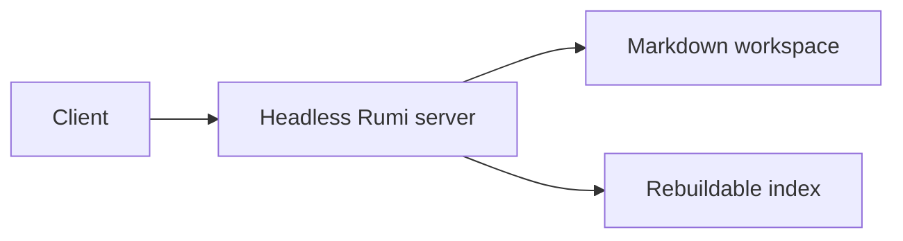

# Complete content fixture

This page exercises every property shape and content-block syntax currently exposed by the Rumi editor.

## Inline content

Plain text, **bold**, *italic*, __underlined__, ~~struck through~~, `inline code`, ==default highlight==, and [an external link](https://example.com).

Colored highlights: ==green::green==, ==blue::blue==, ==purple::purple==, ==pink::pink==, ==red::red==, ==orange::orange==, and ==gray::gray==.

An internal document link points to the [inner test page](inner/inner-page.md).

This line ends with a hard break.  
This text remains in the same paragraph after the break.

### Heading level three

The heading above verifies the smallest supported heading level.

## Bullet list

- Mini PC chassis
- Memory
  - SODIMM
    - DDR5
- Storage

## Numbered list

1. Install memory
2. Install storage
3. Create the boot volume
4. Create the data volume
5. Boot the server

## Task list

- [x] Choose a CPU
- [ ] Install the operating system
  - [ ] Configure backups
- [ ] Run a thermal test

## Quote


> A useful home server should be quiet, efficient, repairable, and understandable.
> 
> The fixture uses realistic content without attempting to be a complete hardware specification.
> 

## Table


| Model                | CPU            | RAM   | Storage | Wi-Fi    |
| :------------------- | :------------: | ----: | :------ | :------- |
| Beelink EQ12         | Intel N100     | 16 GB | 500 GB  | Wi-Fi 6  |
| Minisforum UM790 Pro | Ryzen 9 7940HS | 32 GB | 1 TB    | Wi-Fi 6E |


## Code block


```ts
interface HomeServer {
  model: string
  memoryGb: number
  storageGb: number
  wifi: boolean
}

const candidate: HomeServer = {
  model: "Beelink EQ12",
  memoryGb: 16,
  storageGb: 500,
  wifi: true
}
```


## Mermaid block





## Database block


```db
source: Tasks
filter: status = doing
sort: updated desc
```


## Image block


## File block


![[.assets/missing-test-document.pdf]]


The missing PDF is intentional so the file block's unavailable-asset state can also be tested.


## Link paragraph


[Example domain](https://example.com)


## Divider


---


Content after the divider verifies that normal editing continues after an atomic block.
